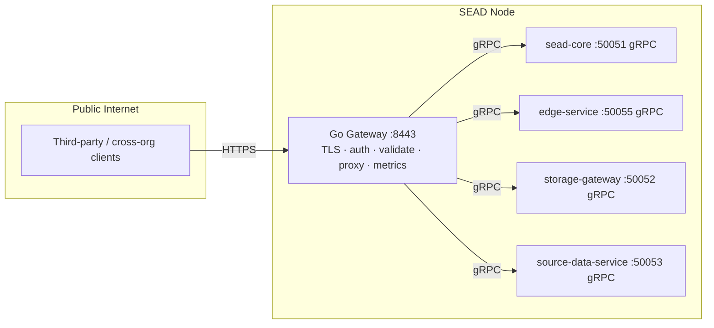

# Stardome SEAD Gateway

**Single public HTTPS entry point for a SEAD node.** Terminates TLS, enforces
auth, and routes to the internal C++ services (sead-core, edge-service,
storage-gateway, source-data-service) over the shared `sead-network` bridge.
Runs as a sidecar alongside each SEAD stack.

## Architecture



The gateway is the **only** public surface of a SEAD node. The C++ services are
**gRPC-only** and publish no public HTTP ports — they are reachable only on the
internal `sead-network` bridge. Cross-node sync fetch is gateway↔gateway HTTPS,
with the gateway's gRPC Sync server (`/sead_rpc.Sync`) on `GATEWAY_GRPC_PORT`
(50054) serving `sead-sync`'s cross-node fetch requests.

## Deploy

### Prerequisites

- Docker + Docker Compose plugin
- A running SEAD stack (see [stardome-sead](https://github.com/Stardome-technology/stardome-sead))
- The gateway image is pre-built at `ghcr.io/stardome-technology/stardome-sead-gateway:latest` (multi-arch amd64 + arm64)

### Quick start

```bash
# 1. Configure runtime env
cp .env.example .env
#    edit .env — set GATEWAY_AUTH_SECRET, TLS, and service targets

# 2. Pull and run (joins the existing sead-network bridge)
docker compose -f docker-compose.remote.yml pull
docker compose -f docker-compose.remote.yml up -d

# 3. Verify
curl http://localhost:8443/health
```

> **Network:** the gateway joins the external `sead-network` bridge that the
> SEAD stack creates. It resolves the internal services by their compose
> service names (`sead-core`, `edge-service`, `storage-gateway`,
> `source-data-service`). Start the SEAD stack first so the network exists.

## Public ports to open

For the gateway to be reachable by third-party / cross-org clients, open on the
host firewall (and any cloud security group):

- **`8443/tcp`** — HTTPS public API (all endpoints)

The gateway replaces `sead-core:30080` as the cross-org entry point (Phase 4.4).
See the [public port contract](https://github.com/Stardome-technology/stardome-sead/blob/main/docs/public-port-contract.md)
for the full list of standardized federation ports.

The internal gRPC ports (`50051`–`50055`) are **private** and must NOT be
exposed publicly — they are reachable only on the `sead-network` bridge.

## Configuration

All configuration via environment variables (see `.env.example`):

| Variable | Default | Description |
|----------|---------|-------------|
| `GATEWAY_LISTEN_ADDR` | `:8443` | Address to listen on |
| `GATEWAY_TLS_ENABLED` | `false` | Enable TLS termination |
| `GATEWAY_TLS_CERT` | | Path to TLS certificate |
| `GATEWAY_TLS_KEY` | | Path to TLS private key |
| `GATEWAY_AUTH_ENABLED` | `true` | Enable Bearer token auth |
| `GATEWAY_AUTH_SECRET` | | Shared secret for token validation |
| `GATEWAY_EDGE_TOKENS` | | Comma-separated edge token secrets |
| `GATEWAY_AUTH_CBOR_ENABLED` | `true` | CBOR auth-token verification |
| `GATEWAY_AUTH_CBOR_SEAD_CORE_URL` | `http://sead-core:50051` | sead-core for key resolution |
| `GATEWAY_AUTH_CBOR_CACHE_TTL` | `60` | Key cache TTL (s) |
| `GATEWAY_AUTH_CBOR_SKEW_TOLERANCE` | `30` | Token skew tolerance (s) |
| `GATEWAY_METRICS_ENABLED` | `true` | Enable `/metrics` endpoint |
| `GATEWAY_LOG_LEVEL` | `info` | Log level |
| `GATEWAY_READ_TIMEOUT` | `30s` | HTTP read timeout |
| `GATEWAY_WRITE_TIMEOUT` | `30s` | HTTP write timeout |
| `GATEWAY_IDLE_TIMEOUT` | `90s` | HTTP idle timeout |
| `GATEWAY_PROXY_TIMEOUT` | `30s` | Upstream proxy timeout |
| `SVC_SEAD_CORE_GRPC` | `sead-core:50051` | sead-core gRPC target |
| `SVC_EDGE_SERVICE_GRPC` | `edge-service:50055` | edge-service gRPC target |
| `SVC_STORAGE_GRPC` | `storage-gateway:50052` | storage-gateway gRPC target |
| `SVC_SOURCE_DATA_GRPC` | `source-data-service:50053` | source-data-service gRPC target |
| `GATEWAY_GRPC_PORT` | `50054` | Gateway Sync gRPC port |

## Endpoints

### Public API (authenticated)

| Path | Method | Backend |
|------|--------|---------|
| `/ingest` | POST | edge-service |
| `/receipt/{id}` | GET | edge-service |
| `/chain-of-custody/{hash}` | GET | edge-service |
| `/verification-package/{hash}` | GET | edge-service |
| `/events/{id}` | GET | sead-core |
| `/events/batch-resolve` | POST | sead-core |
| `/peers` | GET | sead-core |
| `/frontier-summary` | POST | sead-core |
| `/frontier` | GET | sead-core |
| `/orgs/{id}` | GET | sead-core |
| `/edges/{id}` | GET | sead-core |
| `/events/by-org/{org}/genesis` | GET | sead-core |
| `/events/by-edge/{org}/{edge}/authorizations` | GET | sead-core |
| `/events/by-org/{org}/revocations` | GET | sead-core |
| `/events/by-edge/{org}/{edge}/revocations` | GET | sead-core |
| `/events/{id}/dependencies` | GET | sead-core |
| `/pin` | POST | gateway (native Go IPFS client) |
| `/cid/{hash}` | GET | gateway (native Go IPFS client) |
| `/verify` | POST | gateway (collapsed verifier) |
| `/disclosure/request` | POST | source-data-service |
| `/source-data/{hash}` | GET | source-data-service |
| `/source-data/{hash}/audit` | GET | source-data-service |

### Internal (no auth)

| Path | Method | Description |
|------|--------|-------------|
| `/health` | GET | Health check |
| `/metrics` | GET | Prometheus metrics |

## Development

The gateway source lives in the private repo
(`stardome-sead-gateway-private`). This public repo is the deployment surface:
it references the published `ghcr.io` image and documents the runtime
configuration. See the private repo's `Makefile` for the multi-arch build/push
workflow.

## License

Apache License 2.0 — see [LICENSE](LICENSE).